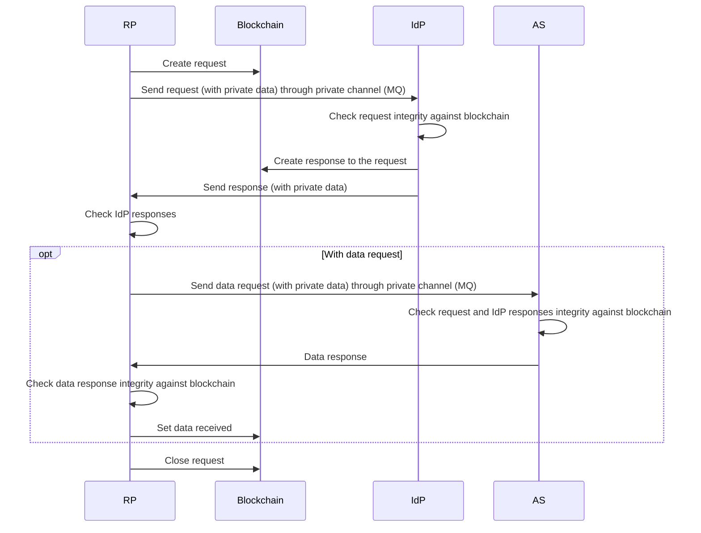

## Request Flow

### RP&rarr;IdP

RP creates a request and send to IdP

#### Blockchain

Data type: JSON

| Property Name        | Data Type                          | Description                         | Remarks                  |
| -------------------- | ---------------------------------- | ----------------------------------- | ------------------------ |
| mode                 | number                             |                                     |                          |
| request_id           | string                             |                                     |                          |
| min_idp              | number                             |                                     |                          |
| min_ial              | number                             |                                     |                          |
| min_aal              | number                             |                                     |                          |
| request_timeout      | number                             |                                     |                          |
| data_request_list    | array of _Data Request Blockchain_ |                                     | Empty if no data request |
| request_message_hash | string                             |                                     |                          |
| idp_id_list          | array of string                    | List of IdP node IDs RP requests to |                          |
| purpose              | string                             |                                     |                          |

_Data Request Blockchain_

| Property Name       | Data Type       | Description                        | Remarks |
| ------------------- | --------------- | ---------------------------------- | ------- |
| service_id          | string          |                                    |         |
| as_id_list          | array of string | List of AS node IDs RP requests to |         |
| min_as              | number          |                                    |         |
| request_params_hash | string          |                                    |         |

#### Private Channel (Message Queue)

Data type: JSON

| Property Name                 | Data Type               | Description                                                                                                             | Remarks                                   |
| ----------------------------- | ----------------------- | ----------------------------------------------------------------------------------------------------------------------- | ----------------------------------------- |
| mode                          | number                  |                                                                                                                         |                                           |
| reference_group_code          | string                  |                                                                                                                         | Mode 2 and 3                              |
| namespace                     | string                  |                                                                                                                         | Mode 1, Mode 2 and 3 (on-the-fly onboard) |
| identifier                    | string                  |                                                                                                                         | Mode 1, Mode 2 and 3 (on-the-fly onboard) |
| request_id                    | string                  |                                                                                                                         |                                           |
| min_ial                       | number                  |                                                                                                                         |                                           |
| min_aal                       | number                  |                                                                                                                         |                                           |
| request_timeout               | number                  |                                                                                                                         |                                           |
| data_request_list             | array of _Data Request_ |                                                                                                                         | Empty if no data request                  |
| data_request_params_salt_list | array of string         |                                                                                                                         | Empty if no data request                  |
| request_message               | string                  |                                                                                                                         |                                           |
| request_message_salt          | string                  |                                                                                                                         |                                           |
| initial_salt                  | string                  |                                                                                                                         |                                           |
| rp_id                         | string                  | Sender node ID (acted as RP)                                                                                            |                                           |
| creation_time                 | number                  | UNIX Timestamp in milliseconds on request creation from RP machine.                                                     |                                           |
| chain_id                      | string                  |                                                                                                                         |                                           |
| height                        | integer                 | Block height which the request on blockchain is in.  IdP need to sync to this height in order to continue the flow. |                                           |

_Data Request_

| Property Name | Data Type       | Description                        | Remarks |
| ------------- | --------------- | ---------------------------------- | ------- |
| service_id    | string          |                                    |         |
| as_id_list    | array of string | List of AS node IDs RP requests to |         |
| min_as        | number          |                                    |         |

### IdP&rarr;RP

IdP create a response to a request from RP and send back to RP

#### Blockchain

Data type: JSON

| Property Name | Data Type | Description                        | Remarks |
| ------------- | --------- | ---------------------------------- | ------- |
| request_id    | string    |                                    |         |
| ial           | number    |                                    |         |
| aal           | number    |                                    |         |
| status        | string    |                                    |         |
| signature     | string    | Signed request message padded hash |         |

#### Private Channel (Message Queue)

Data type: JSON

| Property Name | Data Type | Description                                                                                                                 | Remarks      |
| ------------- | --------- | --------------------------------------------------------------------------------------------------------------------------- | ------------ |
| request_id    | string    |                                                                                                                             |              |
| mode          | number    |                                                                                                                             |              |
| accessor_id   | string    |                                                                                                                             | Mode 2 and 3 |
| idp_id        | string    | IdP node ID                                                                                                                 |              |
| chain_id      | string    |                                                                                                                             |              |
| height        | integer   | Block height which the IdP response on blockchain is in.  RP need to sync to this height in order to continue the flow. |              |

### RP&rarr;AS

RP sends data request to AS after got consent from user through IdP

#### Private Channel (Message Queue)

Data type: JSON

| Property Name              | Data Type                        | Description                                                                                                                 | Remarks |
| -------------------------- | -------------------------------- | --------------------------------------------------------------------------------------------------------------------------- | ------- |
| request_id                 | string                           |                                                                                                                             |         |
| mode                       | number                           |                                                                                                                             |         |
| namespace                  | string                           |                                                                                                                             |         |
| identifier                 | string                           |                                                                                                                             |         |
| service_data_request_list  | array of _Service Data Request_  |                                                                                                                             |         |
| request_message            | string                           |                                                                                                                             |         |
| request_message_salt       | string                           |                                                                                                                             |         |
| response_private_data_list | array of _Response Private Data_ |                                                                                                                             |         |
| request_timeout            | number                           |                                                                                                                             |         |
| initial_salt               | string                           |                                                                                                                             |         |
| rp_id                      | string                           | Sender node ID (acted as RP)                                                                                                |         |
| creation_time              | number                           | UNIX Timestamp in milliseconds on request creation from RP machine.                                                         |         |
| chain_id                   | string                           |                                                                                                                             |         |
| height                     | integer                          | Block height which the IdP response on blockchain is in.  AS need to sync to this height in order to continue the flow. |         |

_Service Data Request_

| Property Name       | Data Type | Description | Remarks |
| ------------------- | --------- | ----------- | ------- |
| service_id          | string    |             |         |
| request_params      | string    |             |         |
| request_params_salt | string    |             |         |

_Response Private Data_

| Property Name | Data Type       | Description | Remarks      |
| ------------- | --------------- | ----------- | ------------ |
| idp_id        | string          |             |              |
| accessor_id   | array of string |             | Mode 2 and 3 |

### AS&rarr;RP

AS sends data response back to RP

#### Blockchain

Data type: JSON

| Property Name | Data Type | Description | Remarks |
| ------------- | --------- | ----------- | ------- |
| request_id    | string    |             |         |
| service_id    | string    |             |         |
| signature     | string    | Signed data |         |

#### Private Channel (Message Queue)

Data type: JSON

| Property Name | Data Type | Description                                                                                                                  | Remarks |
| ------------- | --------- | ---------------------------------------------------------------------------------------------------------------------------- | ------- |
| request_id    | string    |                                                                                                                              |         |
| service_id    | string    |                                                                                                                              |         |
| signature     | string    |                                                                                                                              |         |
| data          | string    |                                                                                                                              |         |
| data_salt     | string    |                                                                                                                              |         |
| as_id         | string    | AS node ID                                                                                                                   |         |
| chain_id      | string    |                                                                                                                              |         |
| height        | integer   | Block height which the data response on blockchain is in.  RP need to sync to this height in order to continue the flow. |         |

### RP (Set data received)

RP confirms data recieved from AS to blockchain

#### Blockchain

Data type: JSON

| Property Name | Data Type | Description | Remarks |
| ------------- | --------- | ----------- | ------- |
| request_id    | string    |             |         |
| service_id    | string    |             |         |
| as_id         | string    | AS node ID  |         |

### RP (Close request, Timeout request)

#### Blockchain

Data type: JSON

| Property Name       | Data Type                 | Description | Remarks |
| ------------------- | ------------------------- | ----------- | ------- |
| request_id          | string                    |             |         |
| response_valid_list | array of _Response Valid_ |             |         |

_Response Valid_

| Property Name   | Data Type | Description                        | Remarks |
| --------------- | --------- | ---------------------------------- | ------- |
| idp_id          | string    | IdP node ID                        |         |
| valid_ial       | boolean   | Validity of IdP response IAL       |         |
| valid_signature | boolean   | Validity of IdP response signature |         |

## Register Identity (Onboard) Flow

### Register Identity

#### Blockchain

Data type: JSON

| Property Name        | Data Type           | Description                                                        | Remarks                          |
| -------------------- | ------------------- | ------------------------------------------------------------------ | -------------------------------- |
| reference_group_code | string              |                                                                    |                                  |
| new_identity_list    | array of _Identity_ |                                                                    |                                  |
| ial                  | number              |                                                                    |                                  |
| mode_list            | array of number     |                                                                    | Only `2` and `3` are allowed     |
| accessor_id          | string              |                                                                    |                                  |
| accessor_public_key  | string              |                                                                    |                                  |
| accessor_type        | string              | Public key type                                                    | Currently, only `RSA` is allowed |
| request_id           | string              | Request ID of consented request from user for registering identity |                                  |

_Identity_

| Property Name            | Data Type | Description                         | Remarks |
| ------------------------ | --------- | ----------------------------------- | ------- |
| identity_namespace       | string    |                                     |         |
| identity_identifier_hash | string    | SHA-256 hash of identity identifier |         |

## Revoke Identity Association Flow

### Revoke Identity Association

#### Blockchain

Data type: JSON

| Property Name            | Data Type | Description                                                                 | Remarks |
| ------------------------ | --------- | --------------------------------------------------------------------------- | ------- |
| reference_group_code     | string    |                                                                             |         |
| identity_namespace       | string    |                                                                             |         |
| identity_identifier_hash | string    | SHA-256 hash of identity identifier                                         |         |
| request_id               | string    | Request ID of consented request from user for revoking identity association |         |

## Add Accessor Flow

### Add Accessor

#### Blockchain

Data type: JSON

| Property Name            | Data Type | Description                                                   | Remarks                          |
| ------------------------ | --------- | ------------------------------------------------------------- | -------------------------------- |
| reference_group_code     | string    |                                                               |                                  |
| identity_namespace       | string    |                                                               |                                  |
| identity_identifier_hash | string    | SHA-256 hash of identity identifier                           |                                  |
| accessor_id              | string    |                                                               |                                  |
| accessor_public_key      | string    |                                                               |                                  |
| accessor_type            | string    | Public key type                                               | Currently, only `RSA` is allowed |
| request_id               | string    | Request ID of consented request from user for adding accessor |                                  |

## Revoke Accessor Flow

### Revoke Accessor

#### Blockchain

Data type: JSON

| Property Name    | Data Type       | Description                                                     | Remarks |
| ---------------- | --------------- | --------------------------------------------------------------- | ------- |
| accessor_id_list | array of string |                                                                 |         |
| request_id       | string          | Request ID of consented request from user for revoking accessor |         |

## Update IAL

#### Blockchain

Data type: JSON

| Property Name            | Data Type | Description                         | Remarks |
| ------------------------ | --------- | ----------------------------------- | ------- |
| reference_group_code     | string    |                                     |         |
| identity_namespace       | string    |                                     |         |
| identity_identifier_hash | string    | SHA-256 hash of identity identifier |         |
| ial                      | number    |                                     |         |
