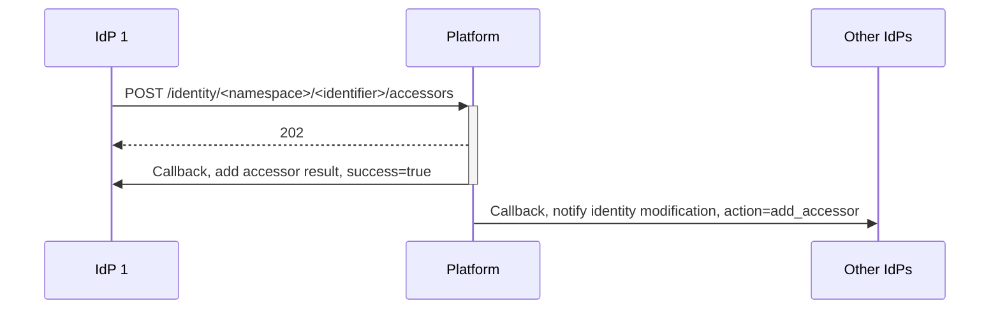
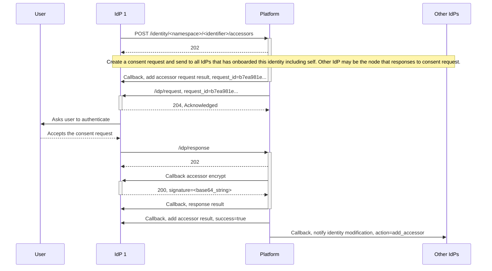

# Add Accessor Flows

## Mode 2

```mermaid
sequenceDiagram
    participant IdP 1
    participant Platform
    participant Other IdPs
    IdP 1->>+Platform: POST /identity/<namespace>/<identifier>/accessors
    Platform-->>IdP 1: 202
    Platform->>-IdP 1: Callback, add accessor result, success=true
    Platform->>Other IdPs: Callback, notify identity modification, action=add_accessor
```

## Mode 3

```mermaid
sequenceDiagram
    participant User
    participant IdP 1
    participant Platform
    participant Other IdPs
    IdP 1->>+Platform: POST /identity/<namespace>/<identifier>/accessors
    Platform-->>IdP 1: 202
    Note over IdP 1,Other IdPs: Create a consent request and send to all IdPs that has onboarded this identity including self. Other IdP may be the node that responses to consent request.
    Platform->>-IdP 1: Callback, add accessor request result, request_id=b7ea981e...
    Platform->>+IdP 1: /idp/request, request_id=b7ea981e...
    IdP 1-->>-Platform: 204, Acknowledged
    IdP 1->>User: Asks user to authenticate
    User-->>IdP 1: Accepts the consent request
    IdP 1->>+Platform: /idp/response
    Platform-->>IdP 1: 202
    Platform->>+IdP 1: Callback accessor encrypt
    IdP 1-->>-Platform: 200, signature=<base64_string>
    Platform->>-IdP 1: Callback, response result
    Platform->>IdP 1: Callback, add accessor result, success=true
    Platform->>Other IdPs: Callback, notify identity modification, action=add_accessor
```
