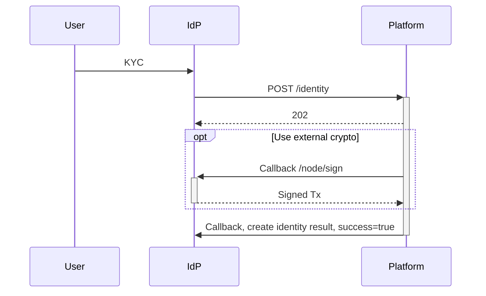
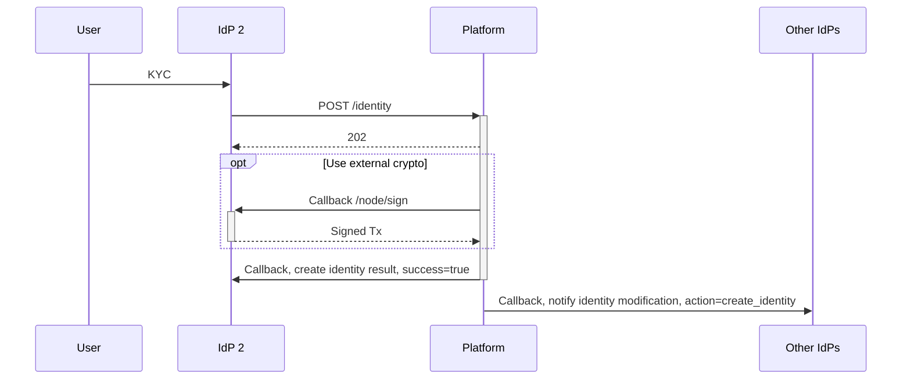
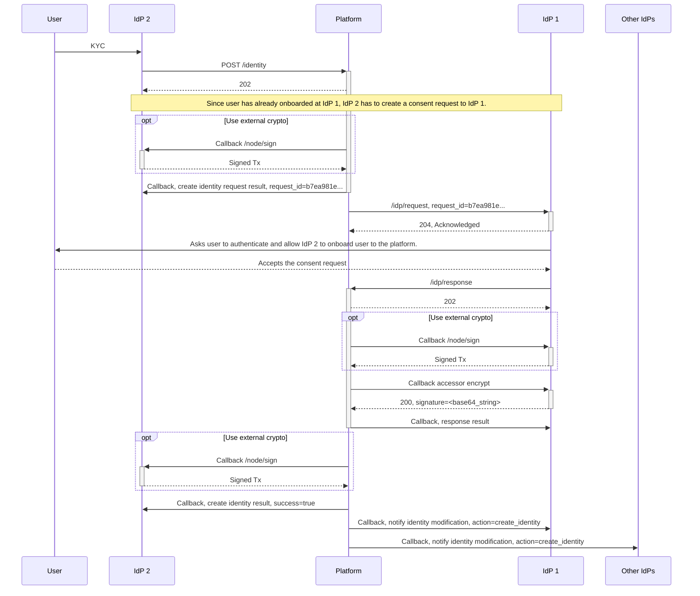

# Create Identity / Onboarding Flows

## Mode 2

### User has no identity on the platform - onboard as first IdP

### User with identity on the platform

## Mode 3

### User has no identity on the platform - onboard as first IdP

Same as mode 2

### User with identity on the platform

