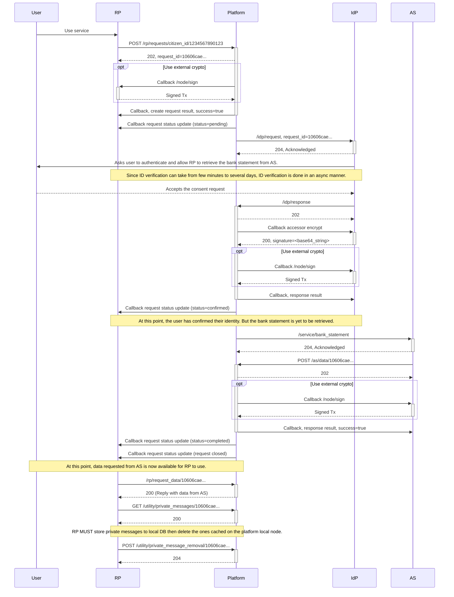

# Data Request Flows

## 1 IdP, 1 AS

```mermaid
sequenceDiagram
    participant User
    participant RP
    participant Platform
    participant IdP
    participant AS
    User->>RP: Use service
    RP->>+Platform: POST /rp/requests/citizen_id/1234567890123
    Platform-->>RP: 202, request_id=10606cae...
    opt Use external crypto
        Platform->>+RP: Callback /node/sign
        RP-->>-Platform: Signed Tx
    end
    Platform->>-RP: Callback, create request result, success=true
    Platform->>RP: Callback request status update (status=pending)
    Platform->>+IdP: /idp/request, request_id=10606cae...
    IdP-->>-Platform: 204, Acknowledged
    IdP->>User: Asks user to authenticate and allow RP to retrieve the bank statement from AS.
    Note over RP,IdP: Since ID verification can take from few minutes to several days, ID verification is done in an async manner.
    User-->>IdP: Accepts the consent request
    IdP->>+Platform: /idp/response
    Platform-->>IdP: 202
    Platform->>+IdP: Callback accessor encrypt
    IdP-->>-Platform: 200, signature=<base64_string>
    opt Use external crypto
        Platform->>+IdP: Callback /node/sign
        IdP-->>-Platform: Signed Tx
    end
    Platform->>-IdP: Callback, response result
    Platform->>RP: Callback request status update (status=confirmed)
    Note over RP,IdP: At this point, the user has confirmed their identity. But the bank statement is yet to be retrieved.
    Platform->>+AS: /service/bank_statement
    AS-->>-Platform: 204, Acknowledged
    AS->>+Platform: POST /as/data/10606cae...
    Platform-->>AS: 202
    opt Use external crypto
        Platform->>+AS: Callback /node/sign
        AS-->>-Platform: Signed Tx
    end
    Platform->>-AS: Callback, response result, success=true
    Platform->>RP: Callback request status update (status=completed)
    Platform->>RP: Callback request status update (request closed)
    Note over User,Platform: At this point, data requested from AS is now available for RP to use.
    RP->>+Platform: /rp/request_data/10606cae...
    Platform-->>-RP: 200 (Reply with data from AS)
    RP->>+Platform: GET /utility/private_messages/10606cae...
    Platform-->>-RP: 200
    Note over RP,Platform: RP MUST store private messages to local DB then delete the ones cached on the platform local node.
    RP->>+Platform: POST /utility/private_message_removal/10606cae...
    Platform-->>-RP: 204
```
