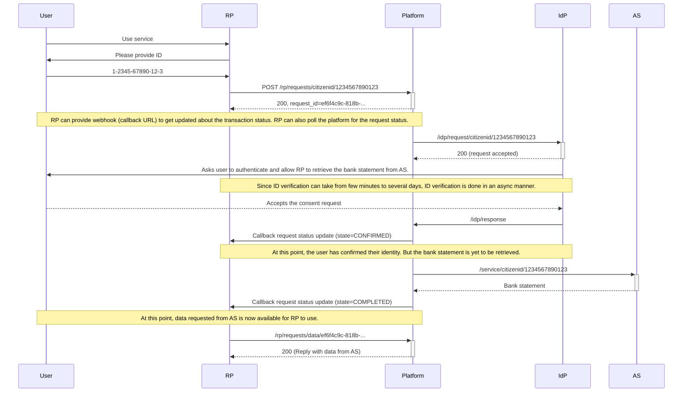

Development hub for Thailand National Digital ID platform.

| Title                   | URL                                           |
| ----------------------- | --------------------------------------------- |
| **Official site**       | <http://www.digitalid.or.th/>                 |
| **GitHub organization** | <https://github.com/ndidplatform>             |
| **HTTP API schema**     | <https://app.swaggerhub.com/apis/ndid/>       |
| **Facebook page**       | <https://www.facebook.com/NationalDigitalID/> |
| **Whitepaper**          | <https://goo.gl/v4Cfpe>                       |
| **Slack**               | <https://bit.ly/2GFWyIn>                      |

## Architecture overview

From the whitepaper:

> The Digital Identity Platform is intended to provide a flexible and highly
> secured method of self-identification for any Thai citizen personal. The
> platform must be able to leverage any reliable identity the user currently
> holds. Examples of reliable identity could be, for example, Citizen Id, Bank
> Accounts, Passport Number, Tax ID, Biometric Data.
>
> The users will interact with a **Relying Party (RP)** to receive services –
> offline or online. In order to successfully receive the services, the users
> are obliged to prove their identities in the form of online or offline
> identity confirmation with any available **Identity Provider (IdP)** who hold
> their identities.
>
> An **Authoritative Source (AS)** is considered as Source of Truth for any
> information relevant to the users. There are currently multiple Source of
> Truth entities. Each entity may keep one or multiple classification of user
> information. The RP can request more user information from AS, if necessary,
> under the permission granted by the users.

## Quick overview

This section gives you a quick overview of the digital identity platform, illustrated through a simple scenario.

Let's consider a use case where you're applying for a Visa at an embassy. They need your identity and bank statement. Without a digital identity platform, this would require a lot of paperwork.

**Note:** This is a concrete scenario designed to help readers understand the system more easily, but the platform is _very flexible_, supporting vast amount of use cases.

With a digital identity platform, this process is much simpler.
First, we define these participants:

- **User**, in this example, the applicant.
- **Relying Party (RP)** relies on the NDID platform to provide service to users. In this example, the embassy.
- **Identity Provider (IdP)** holds the identity of the user, and is able to prove the identity the user.
- **Authoritative Source (AS)** holds the user’s information, such as bank statement. In this example, the bank.
- **The NDID platform**
    - A decentralized app with nodes running on each RP, IdP, and AS, connecting them together.
    - Exposing an HTTP-based API to enable integration with each party.
    - Transaction logs (without ID or private information, but contains zero-knowledge proof to verify the transaction) are recorded on the blockchain ([Tendermint](https://tendermint.com/)).
    - Private information (ID information, data from AS) is communicated between nodes securely through [NSQ](http://nsq.io/).

**Note:** This diagram treats the NDID platform as a black box, only showing the interaction between parties (Users, RP, IdP and AS). For more technical information about how the platform works and communicate securely under the hood, please see the [technical overview](technical-overview.html).

