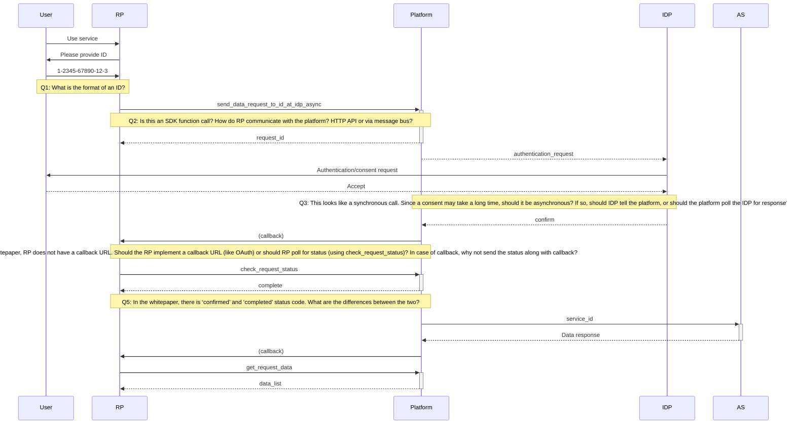

Development hub for Thailand National Digital ID platform.

| Title             | URL                                           |
| ----------------- | --------------------------------------------- |
| **Official site** | <http://www.digitalid.or.th/>                 |
| **Facebook page** | <https://www.facebook.com/NationalDigitalID/> |
| **Whitepaper**    | <https://goo.gl/v4Cfpe>                       |
| **Slack**         | <https://bit.ly/2GFWyIn>                      |

## Architecture overview

From the whitepaper:

> The Digital Identity Platform is intended to provide a flexible and highly
> secured method of self-identification for any Thai citizen personal. The
> platform must be able to leverage any reliable identity the user currently
> holds. Examples of reliable identity could be, for example, Citizen Id, Bank
> Accounts, Passport Number, Tax ID, Biometric Data.
>
> The users will interact with a **Relying Party (RP)** to receive services –
> offline or online. In order to successfully receive the services, the users
> are obliged to prove their identities in the form of online or offline
> identity confirmation with any available Identity Provider, aka. IDP who hold
> their identities.
>
> An Authoritative Source (AS) is considered as Source of Truth for any
> information relevant to the users. There are currently multiple Source of
> Truth entities. Each entity may keep one or multiple classification of user
> information. The RP can request more user information from AS, if necessary,
> under the permission granted by the users.

## Functional requirements

### Consent and data request flow

In this flow, a **User** wants to use the service provided by the **Relying
Party (RP)** which needs identification verification.

#### Scenario: Successful data request

#### Questions:

- Q6: What data is stored on blockchain.
- Q7: Which part is HTTP API? Which part is sent through message bus?
