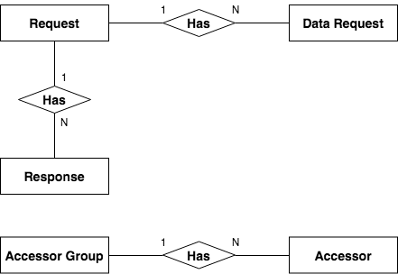

# Public storage (Key-Value Store)

### ER Diagram

### MasterNDID &rarr; NDID’s node master key

  | Key | Value |
  | --- | --- |
  | MasterNDID | -----BEGIN PUBLIC KEY-----\nMIIBIjANBgkqhkiG9w0BAQEFAAOCAQ8AMIIBCg... |

### NodeID | node’s node ID &rarr; Node detail (JSON)

  | Key | Value |
  | --- | --- |
  | NodePublicKeyRole\|NDID | {   &emsp; "public_key": "-----BEGIN PUBLIC KEY-----\nMIIBIjANBgkqhkiG9wOCAQ8...,  &emsp; "master_public_key": "-----BEGIN PUBLIC KEY-----\nMIIBIjANBgkqCAQ...",  &emsp; "node_name": "NDID"   } |

### NodePublicKeyRole|node’s public key &rarr; Role eg. (NDID, RP, IdP, AS)

  | Key | Value |
  | --- | --- |
  | NodePublicKeyRole\|-----BEGIN PUBLIC KEY-----\nMIIBIjANBgkqhkiG9w0BAQEFA... | NDID |

### MaxIalAalNode|IdP node ID &rarr; Max IAL, AAL (JSON)

  | Key | Value |
  | --- | --- |
  | MaxIalAalNode\|IdP1 | {  &emsp;"max_ial": 3,  &emsp;"max_aal": 3 } |

### MsqAddress|node’s node ID &rarr; Ip, port (JSON)

  | Key | Value |
  | --- | --- |
  | MsqAddress\|IdP1 | {  &emsp;"ip": "192.168.3.99",  &emsp;"port": 8000 } |

### IdPList &rarr; List of IdP (JSON)

  | Key | Value |
  | --- | --- |
  | IdPList | [  &emsp;"IdP1",  &emsp;"IdP2" ]  |

### Token|node’s node ID &rarr; Token amount

  | Key | Value |
  | --- | --- |
  | Token\|RP1 | 100.0 |

### TokenPriceFunc|function name &rarr; Price of function

  | Key | Value |
  | --- | --- |
  | TokenPriceFunc\|CreateRequest | 10.0 |

### SpendGas|node’s node ID &rarr; List of spend token (JSON)

  | Key | Value |
  | --- | --- |
  | SpendGas\|RP1 |  [  &emsp;{  &emsp;&emsp;"method": "CreateRequest",  &emsp;&emsp;"price": 1,  &emsp;&emsp;"data" :"ef6f4c9c-818b-42b8-8904-3d97c4c520f6"  &emsp;},  &emsp;{  &emsp;&emsp;"method": "CloseRequest",  &emsp;&emsp;"price": 1,  &emsp;&emsp;"data": "ef6f4c9c-818b-42b8-8904-3d97c4c520f6"  &emsp;} ] |

### AllService &rarr; List of service (JSON)

  | Key | Value |
  | --- | --- |
  | AllService | [  &emsp;{  &emsp;&emsp;"service_id": "statement",  &emsp;&emsp;"service_name": "Bank statement"  &emsp;} ] |

### Service|service’s ID &rarr; Service detail (JSON)

  | Key | Value |
  | --- | --- |
  | Service\|statement | {  &emsp;"service_name": "Bank statement" } |

### ServiceDestination|service’s ID &rarr; List of service destination (JSON)

  | Key | Value |
  | --- | --- |
  | Service\|statement | {  &emsp;"node": [  &emsp;&emsp;{  &emsp;&emsp;&emsp;"id": "AS1",  &emsp;&emsp;&emsp;"name": "AS1",  &emsp;&emsp;&emsp;"min_ial": 1.1,  &emsp;&emsp;&emsp;"min_aal": 1.2,  &emsp;&emsp;&emsp;"service_id": "statement"  &emsp;&emsp;}  &emsp;] } |

### AllNamespace &rarr; List of namespace (JSON)

  | Key | Value |
  | --- | --- |
  | AllService | [  &emsp;{  &emsp;&emsp;"namespace": "CID",  &emsp;&emsp;"description": "Citizen ID"  &emsp;},  &emsp;{  &emsp;&emsp;"namespace": "Tel",  &emsp;&emsp;"description": "Tel number"  &emsp;} ] |

### MsqDestination|hash ID &rarr; List of msq destination (JSON)

  | Key | Value |
  | --- | --- |
  | MsqDestination\|ece8921066562be07...| [  &emsp;{  &emsp;&emsp;"ial": 3,  &emsp;&emsp;"node_id": "IdP1"  &emsp;} ] |

### Request|request ID &rarr; Request detail (JSON)

  | Key | Value |
  | --- | --- |
  | Request\|ef6f4c9c-818b... | {  &emsp;"request_id": "ef6f4c9c-818b-42b8-8904-3d97c4c520f6",  &emsp;"min_idp": 1,  &emsp;"min_aal": 3,  &emsp;"min_ial": 3,  &emsp;"request_timeout": 259200,  &emsp;"data_request_list": [  &emsp;&emsp;{  &emsp;&emsp;&emsp;"service_id": "statement",  &emsp;&emsp;&emsp;"as_id_list": [  &emsp;&emsp;&emsp;&emsp;"AS1",  &emsp;&emsp;&emsp;&emsp;"AS2"  &emsp;&emsp;&emsp;],  &emsp;&emsp;&emsp;"count": 1,  &emsp;&emsp;&emsp;"request_params_hash": "hash",  &emsp;&emsp;&emsp;"answered_as_id_list": [  &emsp;&emsp;&emsp;&emsp;"AS1"  &emsp;&emsp;&emsp;],  &emsp;&emsp;&emsp;"received_data_from_list": []  &emsp;&emsp;}  &emsp;],  &emsp;"request_message_hash": "hash('Please allow...')",  &emsp;"responses": [  &emsp;&emsp;{  &emsp;&emsp;&emsp;"request_id": "ef6f4c9c-818b-42b8-8904-3d97c4c520f6",  &emsp;&emsp;&emsp;"aal": 3,  &emsp;&emsp;&emsp;"ial": 3,  &emsp;&emsp;&emsp;"status": "accept",  &emsp;&emsp;&emsp;"signature": "signature",  &emsp;&emsp;&emsp;"identity_proof": "Magic",  &emsp;&emsp;&emsp;"private_proof_hash": "",  &emsp;&emsp;&emsp;"idp_id": "IdP1"  &emsp;&emsp;}  &emsp;],  &emsp;"closed": false,  &emsp;"timed_out": false,  &emsp;"can_add_accessor": false,  &emsp;"owner": "RP1" } |

### SignData|signature &rarr; Signature of data from AS (JSON)

  | Key | Value |
  | --- | --- |
  | SignData\|e8921066562be0sadasd... | {  &emsp;"service_id": "statement",  &emsp;"request_id": "ef6f4c9c-818b-42b8-8904-3d97c4c520f6",  &emsp;"signature": "e8921066562be0sadasd..." } |

### Accessor|accessor ID &rarr; Accessor detail (JSON)

  | Key | Value |
  | --- | --- |
  | Accessor\|42b8-8904-3sda320f6 | {  &emsp;"accessor_type": "RSA2048",  &emsp;"accessor_public_key": "-----BEGIN PUBLIC KEY-----\nMIIBE...",  &emsp;"accessor_group_id": "3sda3sdAc4c520f6" } |

### AccessorGroup|accessor group ID &rarr; Accessor group ID

  | Key | Value |
  | --- | --- |
  | AccessorGroup\|3sda3sdAc4c520f6 | 3sda3sdAc4c520f6 |